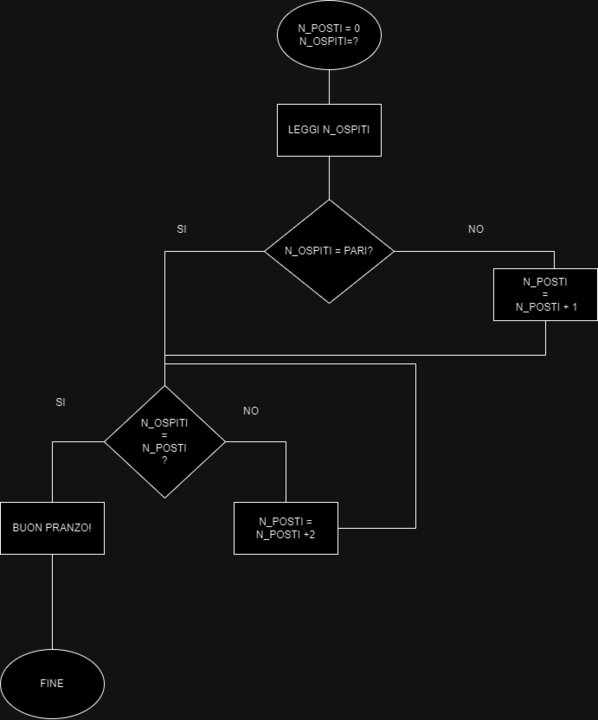

#Contare i posti a tavola di 2 in 2

---

**Dati**
- n-posti = 0
- n-ospiti = ?

---

1. **Leggiamo il numero degli ospiti**

2. **N_Ospiti = PARI?**
- No: "n_posti + 1"
- SI:  andiamo al punto 3

3. **N_ospiti = N_posti?**
- No: aggiungi posti + 2 e torna al punto 3
- Si: Buon pranzo

---

